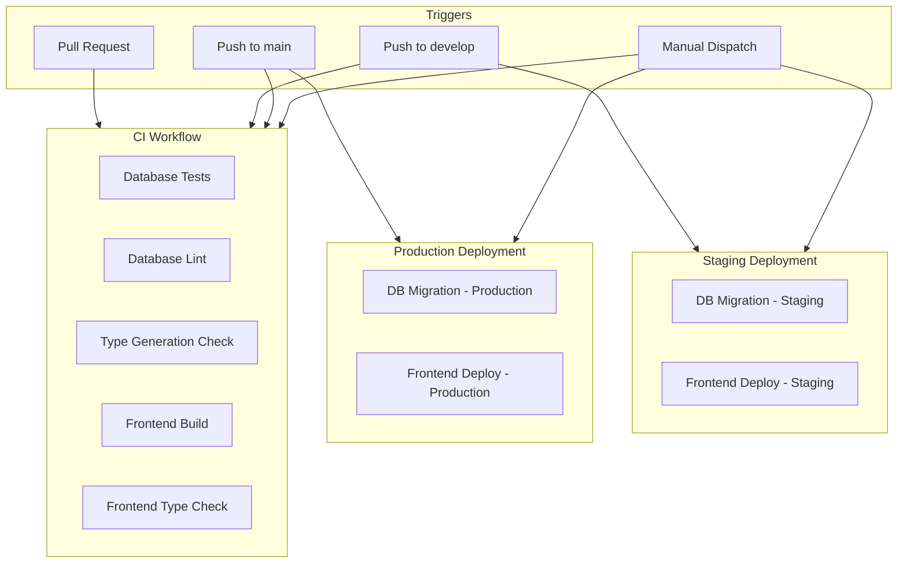
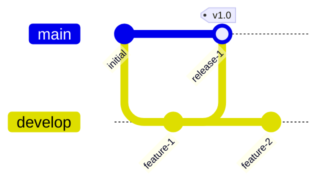

# CI/CD Implementation Plan

## Overview

This plan outlines the implementation of a CI/CD pipeline for the WebApp project, based on the patterns from `supabase-action-example-main` but adapted for this project's specific needs.

## Project Structure

```
Webapp1/
├── frontend/              # Next.js application (static export for GH-Pages)
│   ├── src/
│   ├── package.json
│   └── next.config.ts     # Configured for static export
├── database/              # Supabase database
│   └── supabase/
│       ├── config.toml
│       └── migrations/
└── .github/               # CI/CD workflows (to be created)
    └── workflows/
```

## Workflow Architecture



## Workflows to Create

### 1. CI Workflow - `.github/workflows/ci.yaml`

**Purpose:** Run tests and validations on every PR and push

**Triggers:**
- Pull Request: opened, reopened, synchronize, closed
- Push: main, develop branches
- Manual dispatch

**Jobs:**

| Job | Description | Runs On |
|-----|-------------|---------|
| `db-test` | Start local Supabase, run migrations, lint, and tests | ubuntu-latest |
| `db-dry-run` | Link to remote project and dry-run migrations | ubuntu-latest |
| `frontend-build` | Install dependencies, build, and type-check | ubuntu-latest |

**Job Details:**

#### db-test Job
```yaml
steps:
  - checkout
  - setup supabase-cli
  - supabase db start
  - supabase db lint
  - supabase test db
  - generate types and verify no changes
```

#### db-dry-run Job
```yaml
steps:
  - checkout
  - setup supabase-cli
  - link to staging/production project based on branch
  - supabase db push --dry-run
```

#### frontend-build Job
```yaml
steps:
  - checkout
  - setup node.js
  - npm ci
  - npm run build
  - npx tsc --noEmit
```

### 2. Staging Workflow - `.github/workflows/staging.yaml`

**Purpose:** Deploy to staging environment on push to develop branch

**Triggers:**
- Push to develop branch
- Manual dispatch

**Jobs:**

| Job | Description | Dependencies |
|-----|-------------|--------------|
| `migrate` | Push database migrations to staging | none |
| `deploy` | Deploy frontend to GitHub Pages staging | migrate |

**Environment Configuration:**
- Staging URL: `https://<owner>.github.io/<repo>/staging/`
- Uses `NEXT_PUBLIC_BASE_PATH=/staging` for staging builds

### 3. Production Workflow - `.github/workflows/production.yaml`

**Purpose:** Deploy to production on push to main branch

**Triggers:**
- Push to main branch
- Manual dispatch

**Jobs:**

| Job | Description | Dependencies |
|-----|-------------|--------------|
| `migrate` | Push database migrations to production | none |
| `deploy` | Deploy frontend to GitHub Pages production | migrate |

**Environment Configuration:**
- Production URL: `https://<owner>.github.io/<repo>/`
- Uses `NEXT_PUBLIC_BASE_PATH=` for production builds

## Required GitHub Secrets

| Secret | Description | Used In |
|--------|-------------|---------|
| `SUPABASE_ACCESS_TOKEN` | Supabase personal access token | All workflows |
| `STAGING_DB_PASSWORD` | Staging database password | CI, Staging |
| `STAGING_PROJECT_ID` | Staging project reference ID | CI, Staging |
| `PRODUCTION_DB_PASSWORD` | Production database password | CI, Production |
| `PRODUCTION_PROJECT_ID` | Production project reference ID | CI, Production |

## GitHub Pages Configuration

### Repository Settings Required

1. **Enable GitHub Pages:**
   - Go to Settings > Pages
   - Source: GitHub Actions

2. **Environment Protection Rules:**
   - Production: Require reviewers for deployments
   - Staging: Optional protection

### Workflow Permissions

The `GITHUB_TOKEN` needs write permissions for Pages deployment:

```yaml
permissions:
  pages: write
  id-token: write
  contents: read
```

## File Structure After Implementation

```
.github/
├── workflows/
│   ├── ci.yaml           # Continuous Integration
│   ├── staging.yaml      # Staging deployment
│   └── production.yaml   # Production deployment
```

## Branch Strategy



| Branch | Environment | Deployment |
|--------|-------------|------------|
| `develop` | Staging | Automatic on push |
| `main` | Production | Automatic on push |
| Feature branches | None | CI only |

## Implementation Steps

1. **Create `.github/workflows/` directory**
2. **Create `ci.yaml` workflow**
   - Database testing job
   - Database dry-run job
   - Frontend build job
3. **Create `staging.yaml` workflow**
   - Database migration job
   - Frontend deployment job
4. **Create `production.yaml` workflow**
   - Database migration job
   - Frontend deployment job
5. **Configure GitHub repository settings**
   - Add secrets
   - Enable GitHub Pages
   - Set up environment protection rules
6. **Test the workflows**
   - Create a test PR
   - Verify CI runs correctly
   - Test staging deployment
   - Test production deployment

## Differences from Original Example

| Feature | Original Example | This Implementation |
|---------|-----------------|---------------------|
| Terraform | Yes - infrastructure management | No |
| Preview branches | Yes - branch databases | No |
| Frontend deployment | No | Yes - GitHub Pages |
| Database tests | Yes | Yes |
| Type generation check | Yes | Yes |

## Notes

- The frontend is already configured for static export in `next.config.ts`
- Database migrations are in `database/supabase/migrations/`
- The Supabase config uses PostgreSQL version 17
- Consider adding ESLint and Prettier checks to the CI workflow in the future
