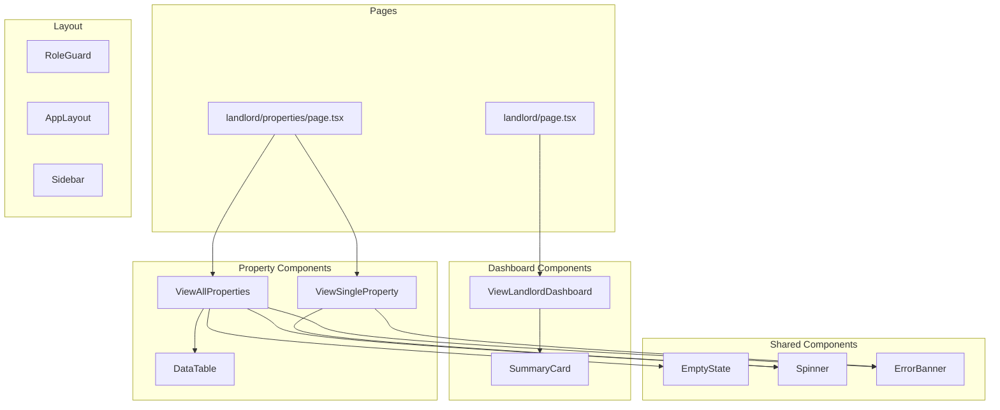

# Landlord Module Implementation Plan

## Overview

This plan details the implementation of the landlord module frontend components, including the dashboard and properties table functionality.

**Related Documents:**
- [Frontend Style Guide](../doc/FRONTEND_STYLE_GUIDE.md)
- [Implementation Plan](../doc/IMPLEMENTATION_PLAN.md)
- [System Architecture Guide](../doc/SYSTEM_ARCHITECTURE_GUIDE.md)

---

## Architecture Summary

### Key Constraints (from Frontend Style Guide)

| Rule | Description |
|------|-------------|
| F-001 | All code in functional style — arrow functions, `const` only, no classes |
| F-002 | Client-only architecture — NO server components, NO SSR |
| F-003 | No `try-catch` — use `{ data, error }` pattern or `.catch()` |
| F-004 | No `if` statements — use ternary `? :`, `&&`, `||`, `??` |
| F-005 | No `let`/`var` — always `const` |
| F-006 | Immutable state updates — always spread, never mutate |
| F-007 | CSS Modules for styling — no inline styles, no CSS-in-JS |
| F-008 | `useAsync` for page-load data, `useAsyncFn` for user actions |
| F-011 | No dynamic routes — use URL search params (`?id=xxx`) |

### Data Sources

| Source | Type | Usage |
|--------|------|-------|
| `properties` | Table | CRUD operations for properties |
| `property_occupancy` | View | Dashboard summary, property list with tenant info |
| `property_financial_summary` | View | Financial metrics per property |
| `active_leases` | View | Active lease information |
| `unpaid_transactions_summary` | View | Unpaid billing summary |

---

## Component Architecture



---

## Component Specifications

### 1. ViewLandlordDashboard

**File:** `frontend/src/components/landlord/ViewLandlordDashboard.tsx`  
**CSS:** `frontend/src/components/landlord/ViewLandlordDashboard.module.css`

#### Purpose
Display overview dashboard with summary cards showing key metrics for the landlord.

#### Data Requirements
```typescript
// Fetch from property_occupancy view
type PropertyOccupancy = Tables<'property_occupancy'>;

// Fetch from unpaid_transactions_summary view
type UnpaidSummary = Tables<'unpaid_transactions_summary'>;

// Fetch from active_leases view
type ActiveLease = Tables<'active_leases'>;
```

#### Summary Cards
| Card | Data Source | Metric |
|------|-------------|--------|
| Total Properties | `property_occupancy` | Count of all properties |
| Occupied | `property_occupancy` | Count where status = occupied |
| Available | `property_occupancy` | Count where status = available |
| Active Leases | `active_leases` | Count of active leases |
| Unpaid Amount | `unpaid_transactions_summary` | Sum of total_unpaid_amount |
| Overdue Items | `unpaid_transactions_summary` | Sum of overdue_items_count |

#### Component Structure
```typescript
'use client';

import { useAsync } from 'react-use';
import { database } from '@/api/database';
import type { Tables } from '@/api/database.types';
import { Spinner } from '@/components/shared/Spinner';
import { ErrorBanner } from '@/components/shared/ErrorBanner';
import { formatCurrency } from '@/utils/formatCurrency';
import styles from './ViewLandlordDashboard.module.css';

export const LandlordDashboard = () => {
    // Fetch data using useAsync
    // Render loading/error states
    // Render summary cards grid
};
```

#### CSS Module Structure
```css
.dashboard {}
.header {}
.title {}
.cardsGrid {}
.summaryCard {}
.cardTitle {}
.cardValue {}
.cardValueSuccess {}
.cardValueWarning {}
.cardValueError {}
```

---

### 2. ViewAllProperties

**File:** `frontend/src/components/landlord/ViewAllProperties.tsx`  
**CSS:** `frontend/src/components/landlord/ViewAllProperties.module.css`

#### Purpose
Display all properties in a table format with navigation to single property view.

#### Data Requirements
```typescript
// Fetch from property_occupancy view for enriched data
type PropertyWithOccupancy = Tables<'property_occupancy'>;
```

#### Table Columns
| Column | Field | Format |
|--------|-------|--------|
| Name | `name` | Link to detail view |
| Address | `address` | Plain text |
| Type | `property_type` | Label from `PROPERTY_TYPE_LABELS` |
| Status | `status` | Badge from `PROPERTY_STATUS_LABELS` |
| Monthly Rent | `monthly_rent` | Currency format |
| Tenant | `current_tenant_name` | Plain text or — |
| Lease End | `lease_end` | Date format or — |

#### Features
- Click row to navigate to `?id=xxx`
- Add new property button → `?action=new`
- Status badges with color coding
- Empty state when no properties

#### Component Structure
```typescript
'use client';

import { useAsync } from 'react-use';
import { useRouter } from 'next/navigation';
import { database } from '@/api/database';
import type { Tables } from '@/api/database.types';
import { DataTable, ColumnDef, getStatusClass, formatCurrencyValue, formatDateValue } from '@/components/shared/DataTable';
import { EmptyState } from '@/components/shared/EmptyState';
import { Spinner } from '@/components/shared/Spinner';
import { ErrorBanner } from '@/components/shared/ErrorBanner';
import { routes } from '@/routes';
import { PROPERTY_STATUS_LABELS, PROPERTY_TYPE_LABELS } from '@/constants/labels';
import styles from './ViewAllProperties.module.css';

export const AllPropertiesList = () => {
    // Fetch properties using useAsync
    // Define columns for DataTable
    // Handle row click navigation
    // Render loading/error/empty states
};
```

#### CSS Module Structure
```css
.container {}
.header {}
.title {}
.actions {}
.addButton {}
.tableContainer {}
.statusBadge {}
```

---

### 3. ViewSingleProperty

**File:** `frontend/src/components/landlord/ViewSingleProperty.tsx`  
**CSS:** `frontend/src/components/landlord/ViewSingleProperty.module.css`

#### Purpose
Display detailed view of a single property with all information and related data.

#### Props
```typescript
interface PropertySingleProps {
    id?: string;  // Property ID from URL params
}
```

#### Data Requirements
```typescript
// Fetch single property from property_occupancy view
type PropertyDetail = Tables<'property_occupancy'>;

// Fetch financial summary from property_financial_summary view
type FinancialSummary = Tables<'property_financial_summary'>;
```

#### Information Sections
1. **Basic Info**: Name, address, type, status, size, bedrooms
2. **Financial**: Monthly rent, deposit amount
3. **Current Lease**: Tenant name, lease dates, rent (if occupied)
4. **Financial Summary**: Total income, expenses, net profit (if available)

#### Actions
- Back to list button
- Edit property button (future: `?action=edit&id=xxx`)

#### Component Structure
```typescript
'use client';

import { useAsync } from 'react-use';
import { useRouter } from 'next/navigation';
import { database } from '@/api/database';
import type { Tables } from '@/api/database.types';
import { Spinner } from '@/components/shared/Spinner';
import { ErrorBanner } from '@/components/shared/ErrorBanner';
import { routes } from '@/routes';
import { formatCurrency } from '@/utils/formatCurrency';
import { formatDate } from '@/utils/formatDate';
import { PROPERTY_STATUS_LABELS, PROPERTY_TYPE_LABELS } from '@/constants/labels';
import styles from './ViewSingleProperty.module.css';

export const PropertySingle = ({ id }: PropertySingleProps) => {
    // Fetch property detail using useAsync
    // Render loading/error states
    // Render property information sections
};
```

#### CSS Module Structure
```css
.container {}
.header {}
.backButton {}
.title {}
.content {}
.section {}
.sectionTitle {}
.infoGrid {}
.infoItem {}
.label {}
.value {}
.statusBadge {}
.financialGrid {}
.amount {}
.amountPositive {}
.amountNegative {}
```

---

## Implementation Order

```
1. ViewLandlordDashboard
   ├── Create ViewLandlordDashboard.tsx
   ├── Create ViewLandlordDashboard.module.css
   └── Test dashboard rendering

2. ViewAllProperties
   ├── Create ViewAllProperties.tsx
   ├── Create ViewAllProperties.module.css
   └── Test properties table with navigation

3. ViewSingleProperty
   ├── Create ViewSingleProperty.tsx
   ├── Create ViewSingleProperty.module.css
   └── Test single property view
```

---

## Data Fetching Patterns

### Pattern 1: Dashboard Data (useAsync)
```typescript
const state = useAsync(async () => {
    const { data: properties, error: propError } = await database
        .from('property_occupancy')
        .select('*');
    
    const { data: unpaid, error: unpaidError } = await database
        .from('unpaid_transactions_summary')
        .select('*');
    
    return {
        properties: propError ? null : properties,
        unpaid: unpaidError ? null : unpaid,
    };
}, []);

// Render states
return (
    state.loading ? <Spinner /> :
    state.error ? <ErrorBanner msg={state.error.message} /> :
    <DashboardContent data={state.value} />
);
```

### Pattern 2: Table with Navigation
```typescript
const router = useRouter();

const handleRowClick = (property: PropertyWithOccupancy) => {
    router.push(routes.landlord.properties({ id: property.id ?? undefined }));
};

const columns: ColumnDef<PropertyWithOccupancy>[] = [
    { key: 'name', label: 'Nazwa' },
    { key: 'address', label: 'Adres' },
    { 
        key: 'property_type', 
        label: 'Typ',
        render: (value) => PROPERTY_TYPE_LABELS[value as string] ?? value
    },
    // ... more columns
];
```

---

## Status Badge Styling

Using existing DataTable helper:
```typescript
import { getStatusClass } from '@/components/shared/DataTable';

// Status mapping for properties
const propertyStatusClass = getStatusClass(property.status, {
    available: styles.statusAvailable,
    occupied: styles.statusOccupied,
    inactive: styles.statusInactive,
});
```

---

## Error Handling

All components follow the same error handling pattern:

```typescript
// Level 1: Hook-level error (network failure)
state.error ? <ErrorBanner msg={state.error.message} retry={handleRefresh} /> :

// Level 2: Loading state
state.loading ? <Spinner /> :

// Level 3: Supabase-level error (RLS denied, bad query)
state.value?.error ? <ErrorBanner msg={state.value.error.message} /> :

// Level 4: Empty state
!state.value?.data?.length ? <EmptyState message="Brak danych" /> :

// Level 5: Success — render data
<Content data={state.value.data} />
```

---

## Files to Create/Modify

| File | Action | Description |
|------|--------|-------------|
| `ViewLandlordDashboard.tsx` | Create | Dashboard component |
| `ViewLandlordDashboard.module.css` | Create | Dashboard styles |
| `ViewAllProperties.tsx` | Create | Properties table component |
| `ViewAllProperties.module.css` | Create | Properties table styles |
| `ViewSingleProperty.tsx` | Create | Single property view |
| `ViewSingleProperty.module.css` | Create | Single property styles |

---

## Verification Checklist

After implementation, verify:

- [ ] `npm run build` succeeds with zero errors
- [ ] Dashboard displays summary cards with correct data
- [ ] Properties table displays all properties
- [ ] Click on property row navigates to detail view
- [ ] Single property view displays all information
- [ ] All loading states show Spinner
- [ ] All error states show ErrorBanner
- [ ] Empty states show EmptyState component
- [ ] Status badges have correct colors
- [ ] Currency values formatted correctly (PLN)
- [ ] Date values formatted correctly (Polish locale)
- [ ] All components follow F-001 through F-008 rules
- [ ] No `if` statements used (ternary only)
- [ ] No `try-catch` blocks used
- [ ] No `let` or `var` used
- [ ] All components use CSS Modules
