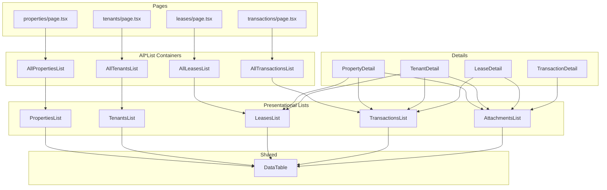

# Frontend Refactoring Plan: Generic List Components

## Overview

This plan outlines the refactoring of the frontend application to create reusable, generic list components that can be used both for:
1. **All*List pages** - Full-page list views showing all records of a table
2. **Detail pages** - Embedded lists showing related/child records

## Current State Analysis

### Database Tables
| Table | Description | Child Tables |
|-------|-------------|--------------|
| `properties` | Rental properties | `lease_agreements`, `transactions`, `attachments` |
| `tenants` | Tenant information | `lease_agreements`, `attachments` |
| `lease_agreements` | Lease contracts | `transactions`, `attachments` |
| `transactions` | Financial transactions | `attachments` |
| `attachments` | File attachments | (polymorphic - links to any table) |

### Existing Components

**List Components (Pure/Presentational):**
- [`PropertiesList.tsx`](frontend/src/components/landlord/lists/PropertiesList.tsx) - Shows properties table

**Container Components (Data Fetching):**
- [`AllPropertiesList.tsx`](frontend/src/components/landlord/AllPropertiesList.tsx) - Fetches all properties
- [`TenantsList.tsx`](frontend/src/components/landlord/TenantsList.tsx) - Fetches all tenants
- [`LeasesList.tsx`](frontend/src/components/landlord/LeasesList.tsx) - Fetches all leases
- [`PaymentsList.tsx`](frontend/src/components/landlord/PaymentsList.tsx) - Fetches transactions

**Detail Components:**
- [`PropertyDetail.tsx`](frontend/src/components/landlord/PropertyDetail.tsx) - Shows: leases, transactions, attachments, tenants
- [`TenantDetail.tsx`](frontend/src/components/landlord/TenantDetail.tsx) - Shows: leases, transactions, attachments
- [`LeaseDetail.tsx`](frontend/src/components/landlord/LeaseDetail.tsx) - Shows: transactions, attachments, property, tenant
- [`TransactionDetail.tsx`](frontend/src/components/landlord/TransactionDetail.tsx) - Shows: attachments, lease/property reference

### Current Issues Identified

1. **Code Duplication**: Each list component has duplicate:
   - Table rendering logic
   - Status badge styling
   - Error/Loading/Empty states
   - Refresh functionality

2. **Inconsistent Patterns**:
   - `PropertiesList` in `lists/` subfolder uses `Tables.module.css`
   - Other lists use inline table rendering with `tableStyles`
   - `AllPropertiesList` exists, but no `AllTenantsList`, `AllLeasesList`, etc.

3. **Detail Components Duplication**:
   - Each *Detail.tsx manually fetches and renders related data in inline tables
   - Same table rendering patterns repeated across detail pages

---

## Proposed Architecture

### 1. Generic DataTable Component

Create a reusable [`DataTable.tsx`](frontend/src/components/shared/DataTable.tsx) component:

```typescript
interface ColumnDef<T> {
  key: keyof T | string;
  label: string;
  render?: (value, row: any: T) => React.ReactNode;
  className?: string;
}

interface DataTableProps<T> {
  data: T[];
  columns: ColumnDef<T>[];
  onRowClick?: (row: T) => void;
  emptyMessage?: string;
  loading?: boolean;
}
```

### 2. Reusable List Components (Presentational)

Create standardized list components in `frontend/src/components/landlord/lists/`:

| Component | File | Displays |
|-----------|------|----------|
| PropertiesList | [`PropertiesList.tsx`](frontend/src/components/landlord/lists/PropertiesList.tsx) | Already exists (refactor to use DataTable) |
| TenantsList | [`TenantsList.tsx`](frontend/src/components/landlord/lists/TenantsList.tsx) | New - create |
| LeasesList | [`LeasesList.tsx`](frontend/src/components/landlord/lists/LeasesList.tsx) | New - create |
| TransactionsList | [`TransactionsList.tsx`](frontend/src/components/landlord/lists/TransactionsList.tsx) | New - create |
| AttachmentsList | [`AttachmentsList.tsx`](frontend/src/components/landlord/lists/AttachmentsList.tsx) | New - create (polymorphic) |

### 3. Container Components (All*List)

Create page-level components that fetch data:

| Component | File | Purpose |
|-----------|------|---------|
| AllPropertiesList | Already exists | Fetch all properties |
| AllTenantsList | [`AllTenantsList.tsx`](frontend/src/components/landlord/AllTenantsList.tsx) | New - create |
| AllLeasesList | [`AllLeasesList.tsx`](frontend/src/components/landlord/AllLeasesList.tsx) | New - create |
| AllTransactionsList | [`AllTransactionsList.tsx`](frontend/src/components/landlord/AllTransactionsList.tsx) | New - create |

### 4. Detail Components Refactoring

Refactor *Detail.tsx to use list components for related data:

| Detail Component | Reusable Lists to Include |
|-----------------|--------------------------|
| PropertyDetail | LeasesList, TransactionsList, AttachmentsList |
| TenantDetail | LeasesList, TransactionsList, AttachmentsList |
| LeaseDetail | TransactionsList, AttachmentsList |
| TransactionDetail | AttachmentsList |

---

## Implementation Steps

### Phase 1: Create Generic DataTable

- [ ] Create [`DataTable.tsx`](frontend/src/components/shared/DataTable.tsx)
- [ ] Create [`DataTable.module.css`](frontend/src/components/shared/DataTable.module.css)
- [ ] Move shared table styles from Tables.module.css to DataTable.module.css

### Phase 2: Refactor PropertiesList

- [ ] Refactor [`PropertiesList.tsx`](frontend/src/components/landlord/lists/PropertiesList.tsx) to use DataTable
- [ ] Remove duplicate styling in Tables.module.css

### Phase 3: Create New List Components

- [ ] Create [`TenantsList.tsx`](frontend/src/components/landlord/lists/TenantsList.tsx)
- [ ] Create [`LeasesList.tsx`](frontend/src/components/landlord/lists/LeasesList.tsx)
- [ ] Create [`TransactionsList.tsx`](frontend/src/components/landlord/lists/TransactionsList.tsx)
- [ ] Create [`AttachmentsList.tsx`](frontend/src/components/landlord/lists/AttachmentsList.tsx)

### Phase 4: Create All*List Container Components

- [ ] Create [`AllTenantsList.tsx`](frontend/src/components/landlord/AllTenantsList.tsx)
- [ ] Create [`AllLeasesList.tsx`](frontend/src/components/landlord/AllLeasesList.tsx)
- [ ] Create [`AllTransactionsList.tsx`](frontend/src/components/landlord/AllTransactionsList.tsx)
- [ ] Update page routing to use new All*List components

### Phase 5: Refactor Detail Components

- [ ] Refactor [`PropertyDetail.tsx`](frontend/src/components/landlord/PropertyDetail.tsx) to use LeasesList, TransactionsList
- [ ] Refactor [`TenantDetail.tsx`](frontend/src/components/landlord/TenantDetail.tsx) to use LeasesList, TransactionsList
- [ ] Refactor [`LeaseDetail.tsx`](frontend/src/components/landlord/LeaseDetail.tsx) to use TransactionsList
- [ ] Refactor all Details to use AttachmentsList

### Phase 6: Cleanup

- [ ] Remove duplicate table styles from ListPage.module.css
- [ ] Remove duplicate status badge logic
- [ ] Update imports across all components
- [ ] Test all pages work correctly

---

## Component Relationships



---

## API/Data Flow

For Detail pages showing related data, the data will be:
1. Fetched by the Detail component (already done via useAsync)
2. Passed to the appropriate List component as props
3. Rendered using the DataTable component

Example for PropertyDetail showing leases:

```typescript
// PropertyDetail.tsx
const leasesState = useAsync(async () => {
  const { data } = await database
    .from('lease_agreements')
    .select('*, tenants(first_name, last_name), properties(name)')
    .eq('property_id', id);
  return data;
}, [id]);

// In render:
<LeasesList 
  leases={leasesState.value?.data ?? []} 
  onRowClick={(lease) => router.push(routes.landlord.leases({ id: lease.id }))}
/>
```

---

## Benefits

1. **Reduced Duplication**: Single DataTable component handles all table rendering
2. **Consistency**: All lists look and behave the same way
3. **Maintainability**: Changes to table rendering only need to happen in one place
4. **Reusability**: List components can be used in both All*List pages and Detail pages
5. **Testability**: Smaller, focused components are easier to test
