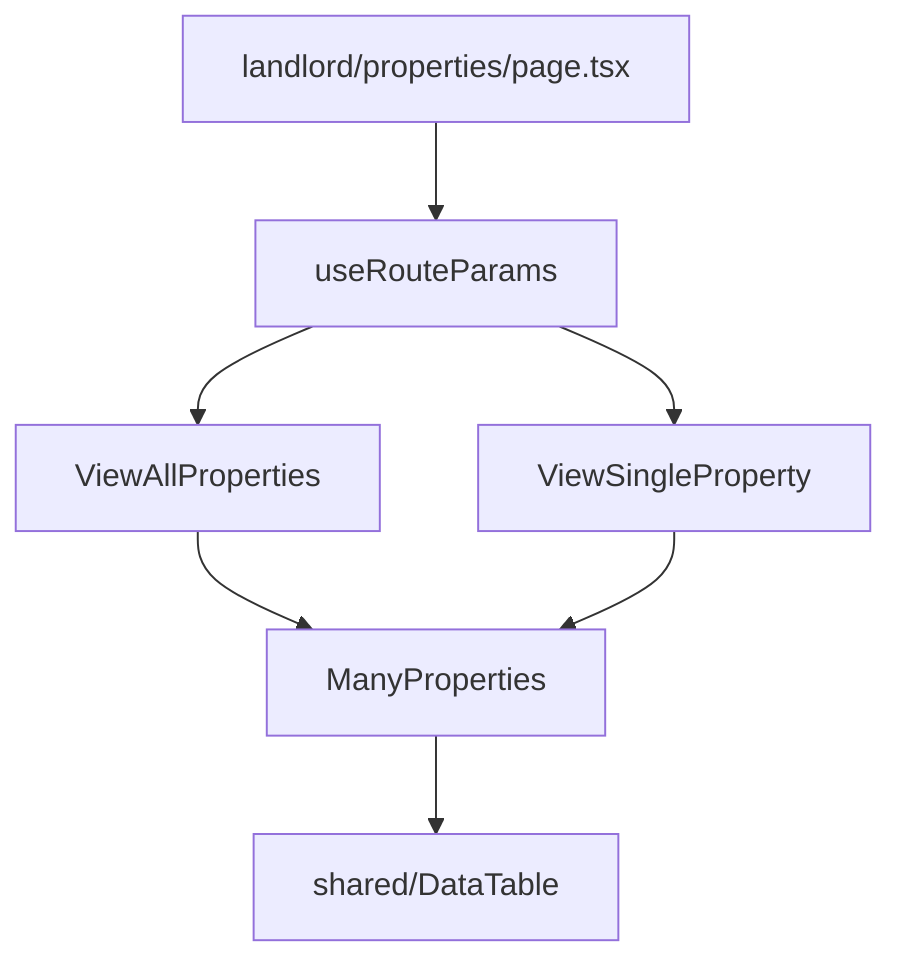

# Landlord Module - Properties Implementation Plan

## Overview
Implement the Properties table components for the Landlord module with read-only operations.

## Property Data Model
Based on [`database.types.ts`](frontend/src/api/database.types.ts:150):

| Field | Type | Description |
|-------|------|-------------|
| id | string | Primary key |
| name | string | Property name |
| address | string | Full address |
| property_type | string | apartment, house, commercial, room |
| status | string | available, occupied, inactive |
| bedrooms | number \| null | Number of bedrooms |
| size_sqm | number \| null | Size in square meters |
| monthly_rent | number | Monthly rent amount |
| deposit_amount | number | Deposit amount |
| notes | string \| null | Additional notes |
| created_at | string \| null | Creation timestamp |
| updated_at | string \| null | Last update timestamp |
| created_by | string \| null | User who created |

## Architecture

## Components to Implement

### 1. ManyProperties.tsx
Reusable component for displaying multiple properties in different contexts:
- Used by ViewAllProperties (main list view)
- Used by ViewSingleProperty (as reference table for related leases)
- Used by other modules (e.g., ViewSingleTenant - properties rented by tenant)

**Props:**
- `data`: Property[] - Array of properties to display
- `isLoading`: boolean - Loading state
- `onRecordClick`: (id: string) => void - Row click handler
- `variant`: 'table' | 'compact' - Display variant (table or compact list)

### 2. ViewAllProperties.tsx
Top-level component for displaying all properties (landlord properties list page):
- Fetches all properties from database
- Renders ManyProperties with table variant
- Handles loading/error states
- Exports as `AllPropertiesList` (required by page.tsx)

### 3. ViewSingleProperty.tsx
Top-level component for viewing single property details:
- Fetches property by ID from URL params
- Displays property information in detail view
- Shows related leases (using ManyLeases)
- Exports as `PropertySingle` (required by page.tsx)
- Handles both detail and new (create) actions

## Implementation Steps

1. **Implement ManyProperties.tsx**
   - Create props interface
   - Implement table display using DataTable component
   - Add column definitions for property fields
   - Use formatCurrency and formatDate utilities
   - Use PROPERTY_STATUS_LABELS and PROPERTY_TYPE_LABELS

2. **Implement ViewAllProperties.tsx**
   - Add useAsync for fetching properties
   - Use database.from('properties').select('*')
   - Handle loading and error states
   - Pass data to ManyProperties component

3. **Implement ViewSingleProperty.tsx**
   - Add useAsync for fetching single property by ID
   - Display property details in card layout
   - Handle case when property not found
   - Handle 'new' action (empty form for future use)

## Conventions Followed
- All components use 'use client' directive
- Use react-use hooks (useAsync, useAsyncFn)
- Import order: React → Third-party → API → Hooks → Components → Utilities → Styles
- Named exports only (except page.tsx)
- CSS Modules for styling
- TypeScript interfaces for props
- Arrow functions only
- No try-catch (use { data, error } pattern)
- No if statements (use ternary operators)
