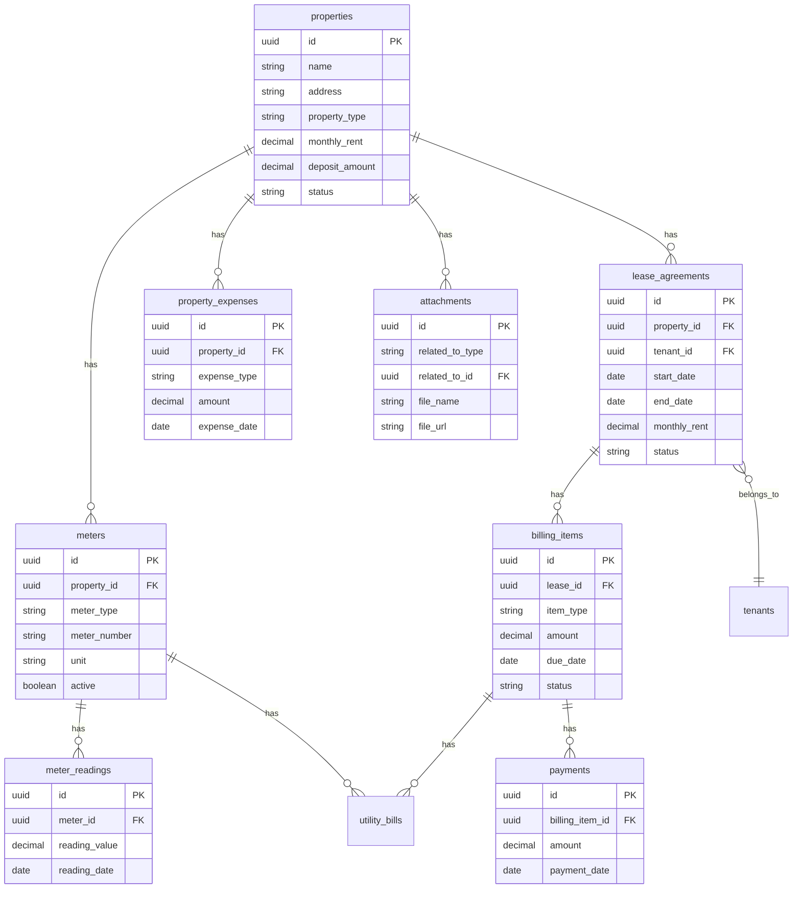
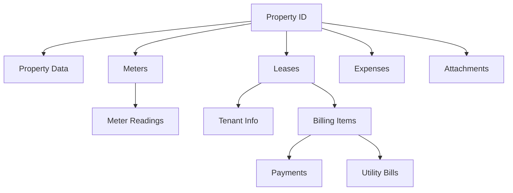

# PropertyDetail Component Redesign Plan

## Overview
Complete redesign of the PropertyDetail component to display a property record along with ALL referenced tables data.

## Database Relationships



## Data Fetching Strategy

### Parallel Queries using useAsync
All queries will run in parallel for optimal performance:

1. **Property Data** - From `property_occupancy` view for enriched data
2. **Meters with Readings** - Meters with their latest readings
3. **Leases History** - All leases for this property with tenant info
4. **Billing Items** - Via lease IDs for this property
5. **Payments** - Via billing item IDs
6. **Expenses** - All property expenses
7. **Attachments** - Files related to this property

### Query Dependencies


## TypeScript Types

All types are already defined in `frontend/src/api/database.types.ts`. Use the generated types from the Database module:

```typescript
import { database } from '@/api/database';
import type { Database } from '@/api/database.types';

// Tables.Row types available:
// - Database['public']['Tables']['properties']['Row']
// - Database['public']['Tables']['meters']['Row']
// - Database['public']['Tables']['meter_readings']['Row']
// - Database['public']['Tables']['lease_agreements']['Row']
// - Database['public']['Tables']['billing_items']['Row']
// - Database['public']['Tables']['payments']['Row']
// - Database['public']['Tables']['property_expenses']['Row']
// - Database['public']['Tables']['attachments']['Row']
// - Database['public']['Tables']['tenants']['Row']

// Views.Row types available:
// - Database['public']['Views']['property_occupancy']['Row']
// - Database['public']['Views']['billing_with_payments']['Row']
// - Database['public']['Views']['active_leases']['Row']
// - Database['public']['Views']['latest_meter_readings']['Row']
// - Database['public']['Views']['property_financial_summary']['Row']
```

### Type Aliases for Convenience
```typescript
// Create type aliases for cleaner code
type PropertyRow = Database['public']['Tables']['properties']['Row'];
type MeterRow = Database['public']['Tables']['meters']['Row'];
type MeterReadingRow = Database['public']['Tables']['meter_readings']['Row'];
type LeaseRow = Database['public']['Tables']['lease_agreements']['Row'];
type BillingItemRow = Database['public']['Tables']['billing_items']['Row'];
type PaymentRow = Database['public']['Tables']['payments']['Row'];
type ExpenseRow = Database['public']['Tables']['property_expenses']['Row'];
type AttachmentRow = Database['public']['Tables']['attachments']['Row'];
type TenantRow = Database['public']['Tables']['tenants']['Row'];

// View types
type PropertyOccupancyView = Database['public']['Views']['property_occupancy']['Row'];
type BillingWithPaymentsView = Database['public']['Views']['billing_with_payments']['Row'];
```

## UI Layout Design

### Component Structure
```
PropertyDetail
├── Header Section
│   ├── Property Name
│   ├── Status Badge
│   └── Edit Button
├── Main Content - Two Column Layout
│   ├── Left Column - Main Sections
│   │   ├── Property Details Section
│   │   │   ├── Address
│   │   │   ├── Type
│   │   │   ├── Monthly Rent
│   │   │   ├── Deposit
│   │   │   ├── Size/Bedrooms
│   │   │   └── Notes
│   │   │
│   │   ├── Current Lease Section - if active
│   │   │   ├── Tenant Link
│   │   │   ├── Rent Amount
│   │   │   ├── Lease Period
│   │   │   └── Link to Lease Details
│   │   │
│   │   ├── Meters Section
│   │   │   ├── Meters Table
│   │   │   │   ├── Type
│   │   │   │   ├── Number
│   │   │   │   ├── Unit
│   │   │   │   ├── Latest Reading
│   │   │   │   └── Active Status
│   │   │   └── Expandable Readings History
│   │   │
│   │   ├── Lease History Section
│   │   │   └── Leases Table
│   │   │       ├── Tenant Name - link
│   │   │       ├── Period
│   │   │       ├── Rent
│   │   │       └── Status Badge
│   │   │
│   │   ├── Billing Section
│   │   │   └── Billing Table
│   │   │       ├── Description
│   │   │       ├── Type
│   │   │       ├── Amount
│   │   │       ├── Paid
│   │   │       ├── Balance
│   │   │       ├── Due Date
│   │   │       └── Status
│   │   │
│   │   ├── Payments Section
│   │   │   └── Payments Table
│   │   │       ├── Date
│   │   │       ├── Amount
│   │   │       ├── Method
│   │   │       └── Related Billing
│   │   │
│   │   ├── Expenses Section
│   │   │   └── Expenses Table
│   │   │       ├── Date
│   │   │       ├── Type
│   │   │       ├── Description
│   │   │       └── Amount
│   │   │
│   │   └── Attachments Section
│   │       └── Attachments Grid
│   │           ├── File Icon
│   │           ├── Name
│   │           ├── Size
│   │           └── Download Link
│   │
│   └── Right Column - Sidebar
│       ├── Quick Stats Card
│       │   ├── Total Meters
│       │   ├── Active Lease
│       │   ├── Total Billing
│       │   ├── Total Paid
│       │   └── Total Expenses
│       │
│       └── Financial Summary Card
│           ├── Income
│           ├── Expenses
│           └── Net Profit
```

## Implementation Details

### File Structure
```
frontend/src/components/landlord/
├── PropertyDetail.tsx          # Main component - UPDATED
└── DetailPage.module.css       # Shared styles - may need additions
```

### Key Implementation Points

1. **Parallel Data Fetching**
   - Use multiple `useAsync` hooks that run independently
   - Chain dependent queries using the results of previous queries
   - Implement proper loading and error states for each section

2. **Section Collapsibility**
   - Consider making sections collapsible for better UX with lots of data
   - Use local state for expand/collapse

3. **Empty States**
   - Use `EmptyState` component for sections with no data
   - Provide helpful messages and action buttons where appropriate

4. **Links to Related Records**
   - All tenant names link to tenant detail
   - All lease IDs link to lease detail
   - All billing items link to billing detail
   - All meters link to meter detail

5. **Data Formatting**
   - Use `formatCurrency` for all monetary values
   - Use `formatDate` for all dates
   - Use type-specific labels for status badges

### CSS Additions Needed
- Collapsible section styles
- Expandable row styles for meter readings
- Financial summary card styles
- Attachments grid styles

## Labels and Translations

### Status Labels
```typescript
const PROPERTY_STATUS_LABELS = {
  available: 'Wolna',
  occupied: 'Zajęta',
  inactive: 'Nieaktywna'
};

const LEASE_STATUS_LABELS = {
  active: 'Aktywna',
  expired: 'Wygasła',
  terminated: 'Rozwiązana'
};

const BILLING_STATUS_LABELS = {
  pending: 'Oczekująca',
  paid: 'Opłacona',
  overdue: 'Przeterminowana'
};

const METER_TYPE_LABELS = {
  electricity: 'Prąd',
  water: 'Woda',
  gas: 'Gaz',
  heating: 'Ogrzewanie'
};

const EXPENSE_TYPE_LABELS = {
  maintenance: 'Naprawy',
  tax: 'Podatki',
  insurance: 'Ubezpieczenie',
  renovation: 'Remont',
  other: 'Inne'
};

const FILE_TYPE_LABELS = {
  image: 'Obraz',
  video: 'Wideo',
  pdf: 'PDF',
  document: 'Dokument',
  other: 'Inny'
};
```

## Tasks for Implementation

1. [ ] Update TypeScript interfaces in PropertyDetail.tsx
2. [ ] Implement parallel data fetching with useAsync
3. [ ] Create property details section
4. [ ] Create current lease section with tenant link
5. [ ] Create meters section with expandable readings
6. [ ] Create lease history section
7. [ ] Create billing section with payment status
8. [ ] Create payments section
9. [ ] Create expenses section
10. [ ] Create attachments section
11. [ ] Add sidebar with stats and financial summary
12. [ ] Add CSS styles for new components
13. [ ] Test all data loading scenarios
14. [ ] Test empty states for each section
