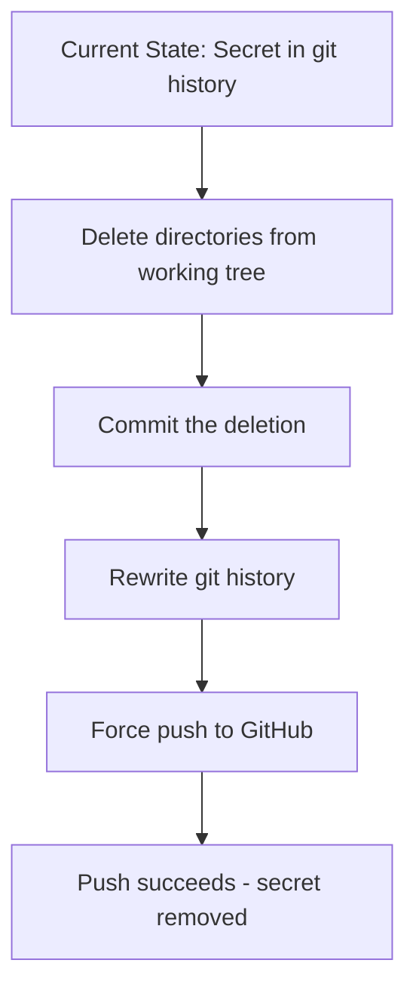

# Plan: Remove Secret from Git History

## Problem
GitHub push protection is blocking a push because a Slack API token was detected in commit `320ead62` at path `doc/Supabase/guides/functions/examples/slack-bot-mention.mdx:24`.

## Solution
Completely remove the `doc/Next` and `doc/Supabase` directories from both the working tree and git history.

## Steps

### Step 1: Delete directories from working tree
```bash
rm -rf doc/Next doc/Supabase
git add -A
git commit -m "Remove doc/Next and doc/Supabase directories"
```

### Step 2: Rewrite git history to remove directories
Using `git-filter-repo` (recommended tool by GitHub):

```bash
# Install git-filter-repo if not available
pip install git-filter-repo

# Remove the directories from all commits
git filter-repo --path doc/Next --path doc/Supabase --invert-paths
```

Alternative using `git filter-branch` (if git-filter-repo is not available):
```bash
git filter-branch --force --index-filter \
  'git rm -rf --cached --ignore-unmatch doc/Next doc/Supabase' \
  --prune-empty --tag-name-filter cat -- --all
```

### Step 3: Force push to GitHub
```bash
git push origin main --force
```

### Step 4: Verify
- Confirm the push succeeds
- Verify the directories are no longer in the repository

## Important Notes
- Force pushing will rewrite history on the remote
- Other collaborators will need to re-clone or rebase
- The secret will be completely removed from git history
- Consider rotating the Slack token if it was ever valid

## Diagram


