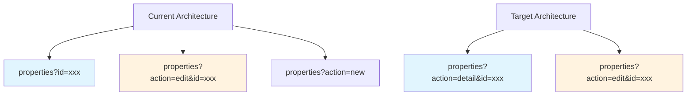

# Single.tsx Component Implementation Plan

## Overview
Merge each pair of `*Detail.tsx` and `*Form.tsx` components into unified `*Single.tsx` components that support both view and edit modes in the same layout.

## Current Architecture (to be changed)

### Current Routing Pattern
```
/landlord/properties          → AllPropertiesList
/landlord/properties?id=xxx   → PropertyDetail  
/landlord/properties?action=edit&id=xxx → PropertyForm
/landlord/properties?action=new  → PropertyForm
```

### Target Routing Pattern
```
/landlord/properties          → AllPropertiesList
/landlord/properties?action=new → PropertySingle (create mode)
/landlord/properties?action=detail&id=xxx → PropertySingle (view mode)
/landlord/properties?action=edit&id=xxx → PropertySingle (edit mode)
```

> Note: `?action=detail&id=xxx` can be simplified to just `?id=xxx` as the default view mode

## Components to Create

### 1. PropertySingle.tsx
**Location:** `frontend/src/components/landlord/PropertySingle.tsx`

Fuses: `PropertyDetail.tsx` + `PropertyForm.tsx`

Features:
- View mode: Shows property details, occupancy, leases, financial summary
- Edit mode: Form with all property fields (name, address, type, size, bedrooms, rent, deposit, status, notes)
- Toggle via "Edit" button in header → adds `?action=edit` to URL
- Cancel returns to view mode (removes `?action=edit`)
- Save returns to view mode with refreshed data

### 2. TenantSingle.tsx
**Location:** `frontend/src/components/landlord/TenantSingle.tsx`

Fuses: `TenantDetail.tsx` + `TenantForm.tsx`

Features:
- View mode: Shows tenant contact info, leases, transactions, attachments
- Edit mode: Form with all tenant fields (firstName, lastName, email, phone, idDocument, emergencyContact, status, notes)
- Toggle via "Edit" button in header

### 3. LeaseSingle.tsx
**Location:** `frontend/src/components/landlord/LeaseSingle.tsx`

Fuses: `LeaseDetail.tsx` + `LeaseForm.tsx`

Features:
- View mode: Shows lease details, property info, tenant info, billing, payments
- Edit mode: Form with all lease fields (tenant, property, dates, rent, deposit, status, notes)
- Toggle via "Edit" button in header

### 4. TransactionSingle.tsx
**Location:** `frontend/src/components/landlord/TransactionSingle.tsx`

Fuses: `TransactionDetail.tsx` + payment registration logic

Features:
- View mode: Shows transaction details, related lease/property
- Edit mode: Update transaction status, amount, description
- "Register Payment" button in sidebar for quick payment recording
- Toggle via "Edit" button in header

## Components to Remove
- `frontend/src/components/landlord/PaymentForm.tsx` (functionality merged into TransactionSingle)

## Implementation Steps

### Step 1: Create Base Pattern (PropertySingle as reference)
```typescript
interface PropertySingleProps {
  id: string;
}

export const PropertySingle = ({ id }: PropertySingleProps) => {
  const [isEditMode, setIsEditMode] = useState(false);
  const searchParams = useSearchParams();
  const action = searchParams.get('action'); // 'detail' | 'edit' | 'new'
  
  useEffect(() => {
    setIsEditMode(action === 'edit');
  }, [action]);
  
  const handleEdit = () => {
    // Navigate to ?action=edit&id=xxx
  };
  
  const handleCancel = () => {
    // Navigate to ?action=detail&id=xxx
  };
  
  const handleSave = () => {
    // Save and navigate to ?action=detail&id=xxx
  };
  
  return isEditMode ? <PropertyFormView /> : <PropertyDetailView />;
};
```

### Step 2: Update Routes
Modify each page file:
- `frontend/src/app/landlord/properties/page.tsx`
- `frontend/src/app/landlord/tenants/page.tsx`
- `frontend/src/app/landlord/leases/page.tsx`
- `frontend/src/app/landlord/transactions/page.tsx`

Remove `action=new` and `action=edit` handling - use `*Single` component only.

### Step 3: Update Route Types
In `frontend/src/routes/index.ts`:
- Update action to: `action?: 'detail' | 'edit' | 'new'`
- Keep `id?: string`

**Current (needs update):**
```typescript
export type PropertyRouteParams = {
    id?: string;
    action?: 'new' | 'edit';
};
```

**Target:**
```typescript
export type PropertyRouteParams = {
    id?: string;
    action?: 'detail' | 'edit' | 'new';
};
```

## Files to Modify
1. Create `frontend/src/components/landlord/PropertySingle.tsx`
2. Create `frontend/src/components/landlord/TenantSingle.tsx`
3. Create `frontend/src/components/landlord/LeaseSingle.tsx`
4. Create `frontend/src/components/landlord/TransactionSingle.tsx`
5. Delete `frontend/src/components/landlord/PaymentForm.tsx`
6. Update `frontend/src/app/landlord/properties/page.tsx`
7. Update `frontend/src/app/landlord/tenants/page.tsx`
8. Update `frontend/src/app/landlord/leases/page.tsx`
9. Update `frontend/src/app/landlord/transactions/page.tsx`
10. Update `frontend/src/routes/index.ts`

## Benefits of This Approach
1. **Better UX**: Users stay in context when editing
2. **Simpler routing**: Single route per entity type
3. **Consistent patterns**: All entities work the same way
4. **Easier maintenance**: Less code duplication
5. **Smoother transitions**: View ↔ Edit without page reloads

## Mermaid Diagram - Current vs Target


